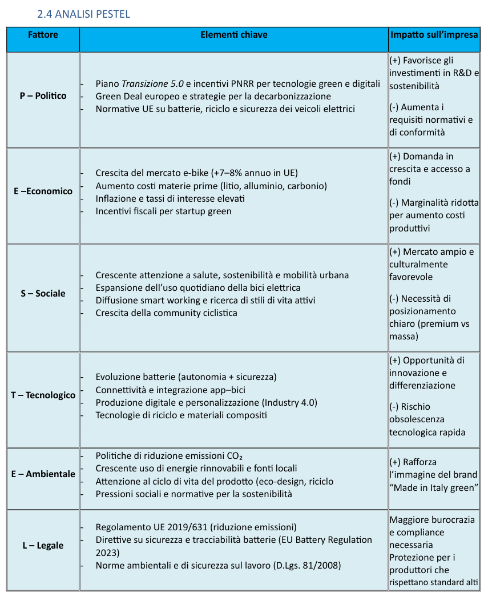
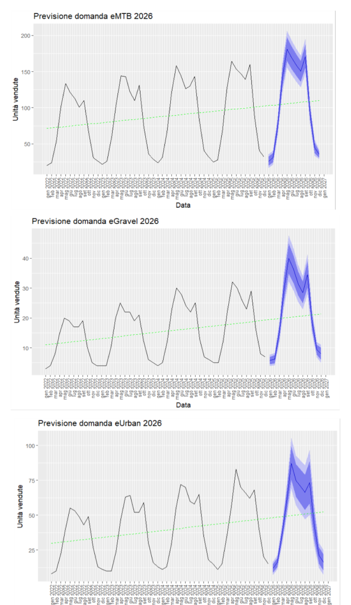
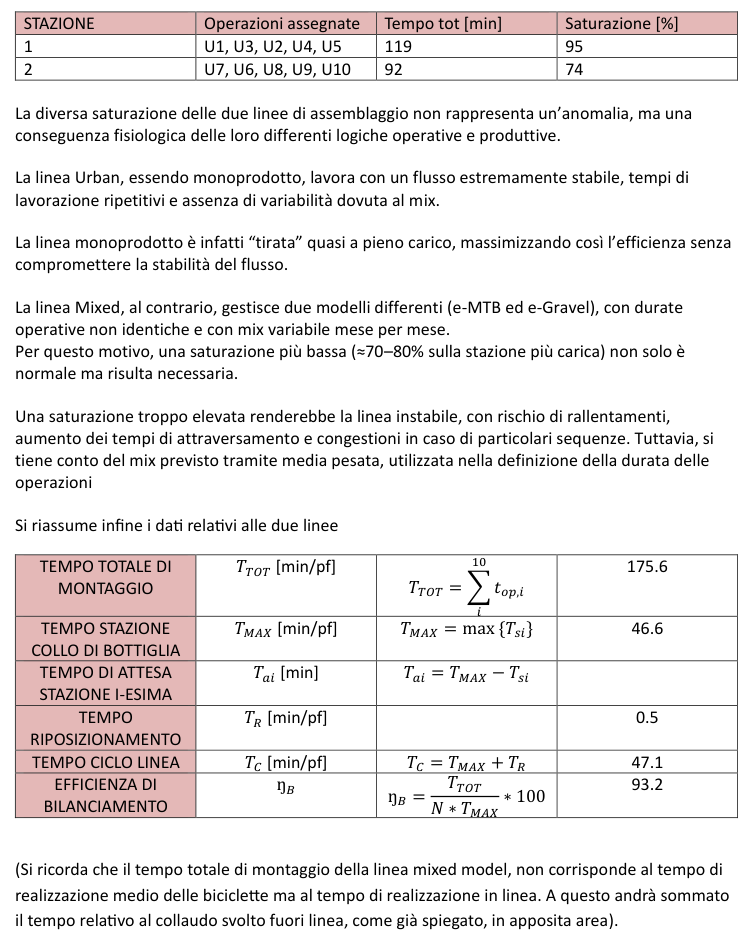
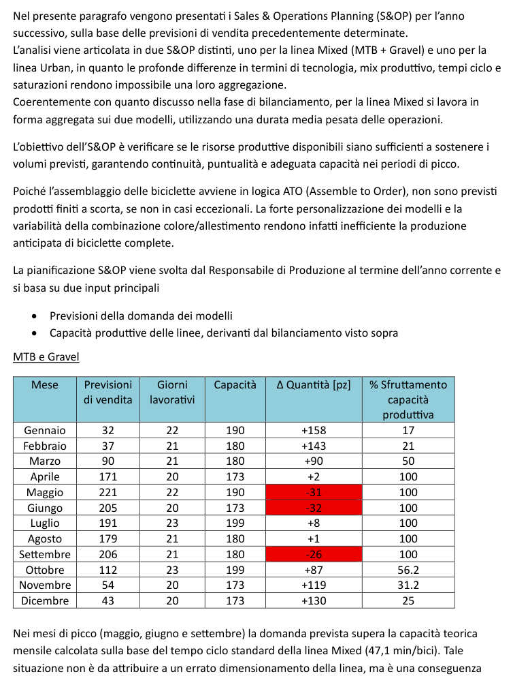
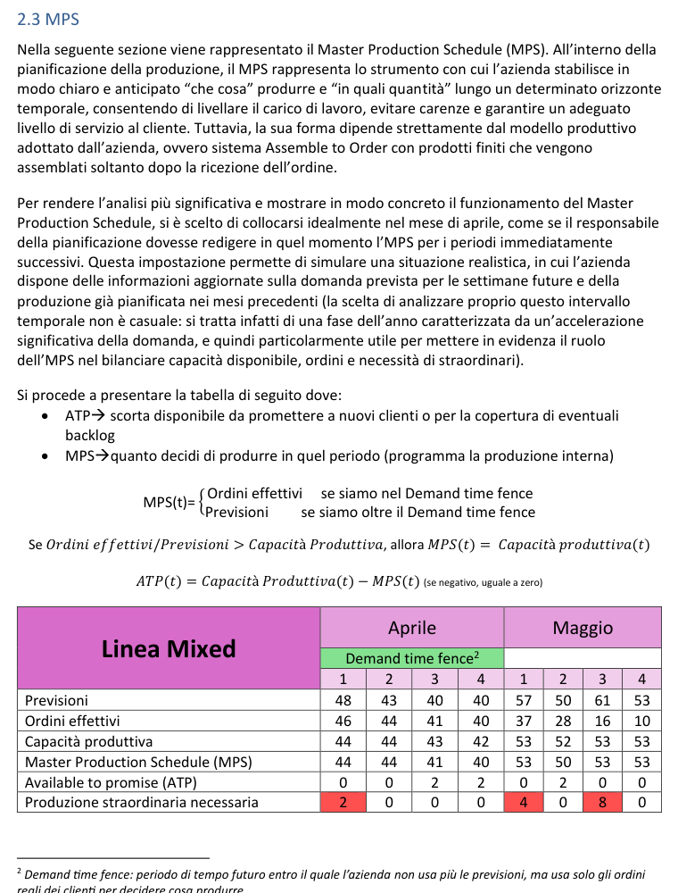
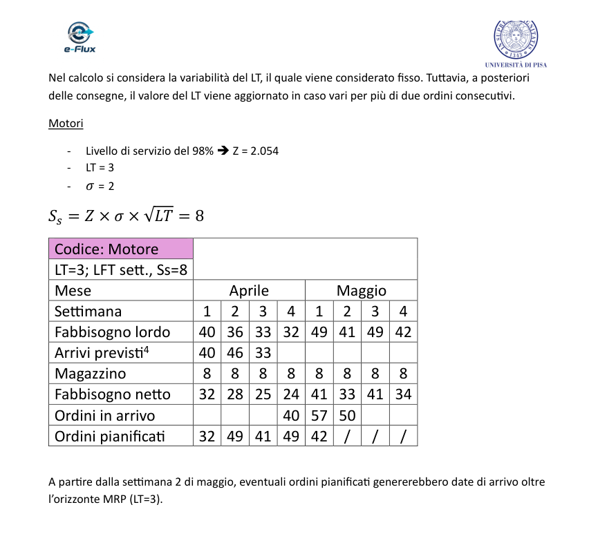
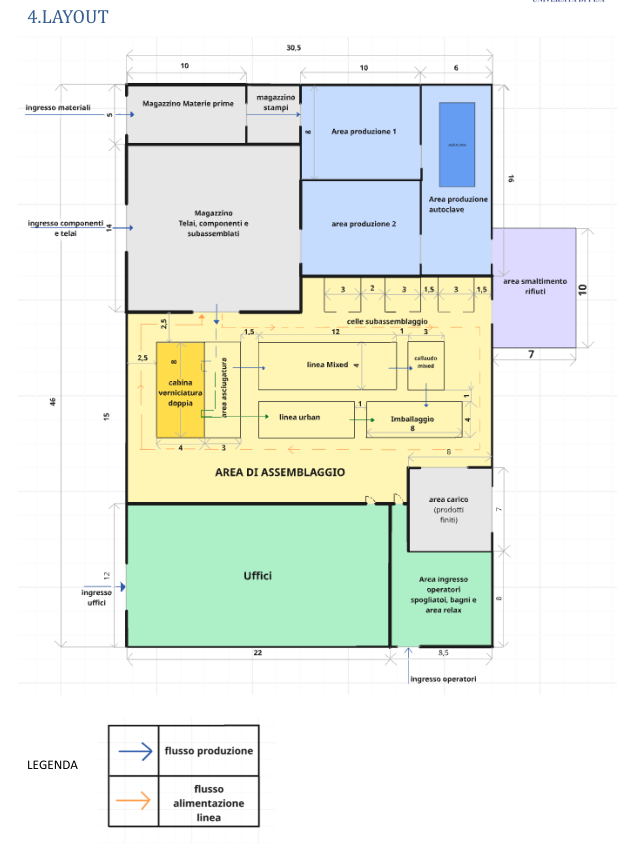
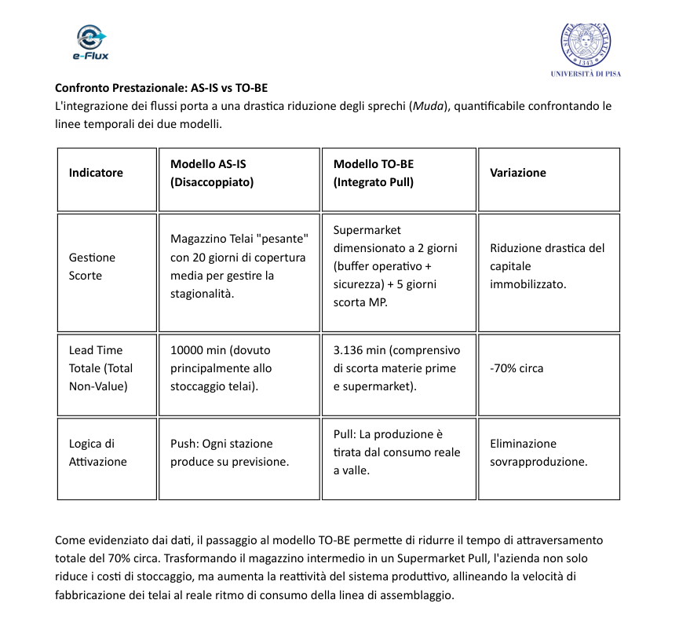

# e-Flux | Production Planning & Supply Chain Design

**Laurea Magistrale in Ingegneria Gestionale - Smart Industry | Università di Pisa**  
**Progetto accademico di gruppo | Progettazione di Impresa | A.A. 2025/2026**

## Project overview

e-Flux è un'azienda fittizia produttrice di e-bike premium, sviluppata nell'ambito di un progetto accademico di progettazione integrata d'impresa.

Il lavoro ha riguardato la progettazione complessiva dell'azienda: analisi di contesto, supply chain, pianificazione della produzione, layout, qualità e miglioramento Lean.

Questo repository presenta il progetto come **case study di Operations & Supply Chain**, con particolare attenzione alle attività di pianificazione della produzione e gestione degli ordini.

### Main topics

- Context & PESTEL Analysis
- Demand Forecasting
- Production Capacity Planning
- Assembly Line Sizing & Balancing
- Sales & Operations Planning (S&OP)
- Master Production Scheduling (MPS)
- Material Requirements Planning (MRP)
- Safety Stock & Reorder Point
- Facility & Material Flow Design
- Value Stream Mapping (VSM)

---

## Il mio contributo

All'interno del progetto di gruppo mi sono occupato principalmente di:

- **analisi di contesto**, inclusa l'analisi PESTEL;
- l'intera sezione di **Production Planning / Order Execution**, comprendente:
  - analisi e dimensionamento della capacità produttiva;
  - valutazione e bilanciamento della capacità delle linee di assemblaggio;
  - Sales & Operations Planning (S&OP);
  - Master Production Scheduling (MPS) e logica Available-to-Promise (ATP);
  - logiche di gestione degli ordini;
  - Material Requirements Planning (MRP);
  - Safety Stock e politiche a Reorder Point;
  - pianificazione dei componenti approvvigionati esternamente.

Le altre sezioni mostrate nel repository, come Demand Forecasting, Facility Layout e il redesign finale tramite VSM, sono risultati del **progetto di gruppo** e vengono incluse per fornire il contesto operativo completo.

---

## 1. Context & PESTEL Analysis

È stata sviluppata un'analisi strutturata del contesto per valutare i principali fattori politici, economici, sociali, tecnologici, ambientali e normativi rilevanti per il settore e-bike.

L'obiettivo era collegare i fattori esterni alle possibili implicazioni su domanda, supply chain, scelte tecnologiche, rischi e requisiti di conformità.

---

## 2. Demand Forecasting

I dati storici mensili di vendita sono stati analizzati per individuare stagionalità e trend nelle tre famiglie di e-bike.

Nel progetto sono stati utilizzati modelli **Holt-Winters in R** per stimare la domanda 2026. La bontà delle previsioni è stata verificata tramite analisi dei residui e metriche di errore, con un **MAPE di circa il 5%**.

Le previsioni così ottenute sono state utilizzate come input per le successive attività di Production Planning.

> Il Demand Forecasting è stato sviluppato nell'ambito del progetto di gruppo ed è stato utilizzato come input per la parte di pianificazione della produzione di cui mi sono occupato.

---

## 3. Production Capacity & Line Balancing

Il sistema produttivo prevede:

- una **mixed-model line** per e-MTB ed e-Gravel;
- una linea dedicata al modello **Urban**.

Il dimensionamento della capacità è stato effettuato considerando domanda prevista, tempo disponibile, takt time, vincoli di precedenza e product mix.

Per la mixed-model line, i tempi delle attività sono stati ponderati in funzione dei volumi attesi dei due modelli e il bilanciamento è stato svolto tramite **Largest Candidate Rule (LCR)**.

### Mixed-model line - Key results

| KPI | Risultato |
|---|---:|
| Total in-line work content | **175,6 min/bike** |
| Bottleneck station time | **46,6 min** |
| Line cycle time | **47,1 min/bike** |
| Line balancing efficiency | **93,2%** |

---

## 4. Sales & Operations Planning (S&OP)

Le previsioni di domanda sono state confrontate con la capacità disponibile delle linee per individuare eventuali shortage nei mesi caratterizzati da maggiore domanda.

Per la mixed line, il primo S&OP ha evidenziato tre mesi particolarmente critici:

| Mese | Domanda prevista | Capacità | Gap iniziale |
|---|---:|---:|---:|
| Maggio | 221 | 190 | **-31** |
| Giugno | 205 | 173 | **-32** |
| Settembre | 206 | 180 | **-26** |

Sono quindi state valutate contromisure operative evitando di dimensionare permanentemente il sistema sui picchi di domanda.

La preparazione di subassemblati nei periodi di bassa saturazione e la standardizzazione delle attività consentono, nello scenario modellato, di ridurre il cycle time effettivo nei mesi di picco di circa **10-15%**, aumentando la capacità giornaliera da circa **8,66 a 9,6 bike/day**.

Gli shortage residui vengono gestiti tramite ricorso mirato allo straordinario.

---

## 5. Master Production Scheduling (MPS)

È stato costruito un MPS settimanale per trasformare la domanda in quantità di produzione eseguibili.

La logica considera:

- ordini cliente effettivi all'interno del **Demand Time Fence**;
- forecast oltre l'orizzonte congelato;
- capacità produttiva disponibile;
- **Available-to-Promise (ATP)**;
- eventuale necessità di produzione straordinaria.

L'esercizio mostra come, avvicinandosi al momento di esecuzione, l'informazione previsionale venga progressivamente sostituita dagli ordini reali dei clienti.

---

## 6. Material Requirements Planning (MRP) & Inventory Policies

A partire dall'MPS sono stati determinati i fabbisogni dei componenti attraverso logiche MRP e distinta base.

Le politiche di approvvigionamento sono state differenziate in funzione di:

- lead time;
- valore economico del componente;
- criticità tecnica;
- livello di servizio desiderato.

L'analisi comprende:

- **Lot-for-Lot (LFL)**;
- **Economic Part Period (EPP)**;
- calcolo del **Safety Stock**;
- politiche a **Reorder Point**;
- pianificazione specifica per componenti e telai approvvigionati esternamente.

L'esempio seguente mostra la logica MRP settimanale applicata a un componente critico, considerando fabbisogno lordo, arrivi previsti, disponibilità a magazzino, fabbisogno netto e ordini pianificati.

---

## 7. Facility & Material Flow Design

Il progetto complessivo ha incluso anche la progettazione del layout produttivo e dei principali flussi di materiale.

Sono state integrate aree dedicate a:

- produzione dei telai;
- magazzini;
- kitting;
- linee di assemblaggio;
- celle di subassemblaggio;
- collaudo;
- packaging e spedizione.

> Questa sezione rappresenta un risultato del progetto di gruppo.

---

## 8. Value Stream Mapping (VSM) & Lean Redesign

Come attività finale di miglioramento, il flusso e-MTB è stato analizzato tramite **Value Stream Mapping**.

La configurazione AS-IS presenta un sistema Push disaccoppiato tra produzione dei telai e assemblaggio finale, con un'elevata quantità di scorta intermedia.

Nel modello TO-BE viene proposta una logica **Pull** con l'introduzione di un supermarket tra produzione telai e assemblaggio.

### AS-IS vs TO-BE - risultato del progetto di gruppo

| KPI | AS-IS | TO-BE |
|---|---:|---:|
| Intermediate frame inventory | ~20 giorni di copertura | Supermarket da 2 giorni + buffer MP |
| Total modeled lead time | ~10.000 min | ~3.136 min |
| Activation logic | Push | Pull |
| Modeled lead-time reduction | - | **~70%** |

> Il redesign tramite VSM è un risultato del progetto di gruppo e non viene presentato come mio contributo individuale.

---

## Methods & Skills

**Operations & Supply Chain**  
S&OP, MPS, MRP, Capacity Planning, Line Balancing, Takt Time, ATP, Safety Stock, Reorder Point, Inventory Policies, VSM, Lean Production

**Quantitative methods**  
Demand Forecasting, Capacity Analysis, Service-Level-Based Safety Stock, Product-Mix Weighting

**Software utilizzato nel progetto complessivo**  
R / RStudio

## Note

Questo è un **progetto accademico basato su un'azienda fittizia e su dati/scenari modellati**. I risultati riportati devono quindi essere interpretati come output progettuali e non come miglioramenti realmente implementati in uno stabilimento industriale.

I report accademici completi non sono inclusi nel repository pubblico.
